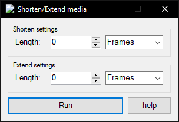

# ShortenExtendMedia
Vegas Pro script for shortening or extending the selected media (text, video, audio, etc)

### Info:  
Press the help button.  
vid: https://www.youtube.com/watch?v=z_W8w6uBasw  
Decreasing the length of the selected objects (Shorten)  
Increase the length of the selected objects (Extend)  
(!) If you change the duration like this, the Composite/FX Keyframes will NOT move.

### Running the script:  
put the file in either  
...\vegas install folder\Script Menu  
or  
...\documents\Vegas Script Menu  
Tools -> Scripting -> Rescan Script Menu Folder -> click on the script name  
You can also add it to the toolbar in Options -> Customize Toolbar

### Building:  
`using Sony.Vegas;` if you have vp13 and below  
`using ScriptPortal.Vegas;` if you have vp14 and above  
The script `ShortenExtendMedia.dll` is created in \bin\debug\  

### References:  
Project -> Add reference -> Browse -> Your VEGAS install folder -> `ScriptPortal.Vegas.dll` or `Sony.Vegas.dll`

### Known bugs:
dunno yet
